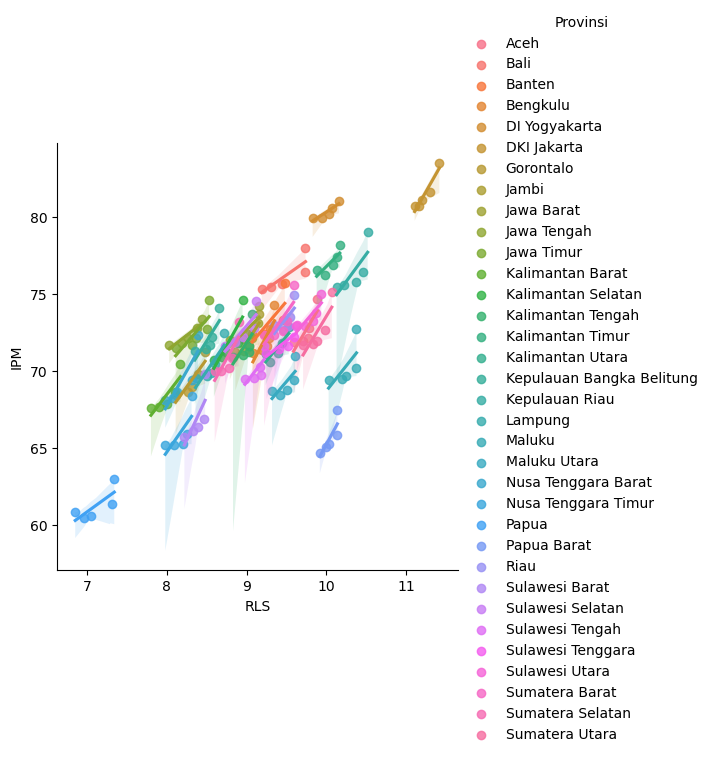
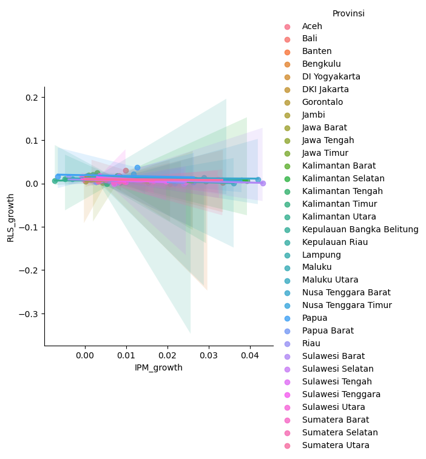
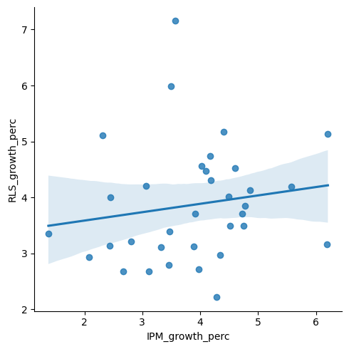

# 📊 Human Development Analysis (IPM vs RLS) — Indonesia 2019–2023

This project explores the relationship between Indonesia’s **Human Development Index (IPM)** and **Mean Years of Schooling (Rata-rata Lama Sekolah / RLS)** across provinces from **2019 to 2023**.

We aim to answer:
> "Is there a meaningful correlation between the quality of human resources (IPM) and education levels (RLS) across time and provinces?"

---

## 📁 Dataset

- **Source**: [BPS (Badan Pusat Statistik)](https://bps.go.id)
- **Years**: 2019–2023
- **Scope**: 34 provinces in Indonesia
- **Variables**:
  - `Provinsi` (Province)
  - `IPM` (Indeks Pembangunan Manusia)
  - `RLS` (Rata-rata Lama Sekolah)

---

## 🧪 Methods

- **Data cleaning**:
  - Converted comma decimals to dot decimals
  - Used `.melt()` to unpivot year columns
  - Extracted numeric years using regex
- **Correlation analysis**:
  - Pearson correlation between raw IPM and RLS values
  - Year-on-year (YoY) growth correlation
  - 5-year percentage growth correlation (2019–2023)
- **Visualization**:
  - Line plots per province showing RLS–IPM trends
  - Seaborn regression plots with confidence intervals

---

## 📈 Key Findings

| Analysis Type | Pearson Correlation | Notes |
|---------------|---------------------|-------|
| Raw values (all years) | **0.697** | Strong correlation |
| YoY growth | -0.29 | Weak, noisy relationship |
| 5-year growth % (2019–2023) | 0.16 | Weak overall alignment |

🔎 Despite strong correlation in raw values, the growth correlation is weaker — possibly due to:
- IPM including health & income dimensions
- Slow-moving RLS changes
- High base effect in developed provinces

---

## 📊 Sample Plot

